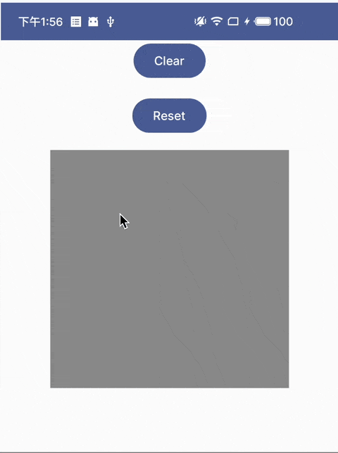

[](https://jitpack.io/#zj565061763/compose-scratchcard)

# Sample



```kotlin
@Composable
private fun Sample() {
  val state = rememberScratchcardState()

  Column {
    Button(onClick = {
      // Clear the overlay
      state.clear()
    }) {
      Text(text = "Clear")
    }

    Button(onClick = {
      // Reset and display the overlay
      state.reset()
    }) {
      Text(text = "Reset")
    }

    ScratchcardBox(
      state = state,
      overlay = {
        // The overlay
        Box(Modifier.background(Color.Gray))
      },
      content = {
        // The content
        Image(
          painter = painterResource(R.drawable.scratchcard_content),
          contentDescription = null,
        )
      },
    )
  }
}
```